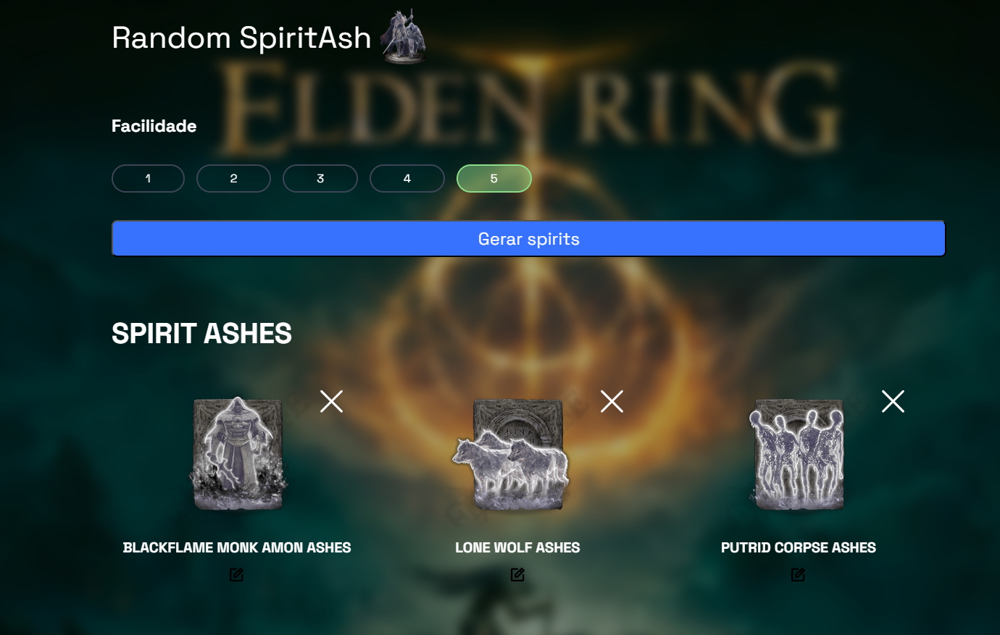

<h1 align="center">
  Random generator spiritAsh
</h1>

  
  
  
  
  

  
  
  

  

## 💻 Projeto
Projeto de um gerador aleatório das cinzas de espirito do jogo elden ring, aonde voce consegue escolher o nível de facilidade que voce jogar.

[Site aqui](https://emanuelhenrique-dev.github.io/RandomSpiritEldenRIng/)
